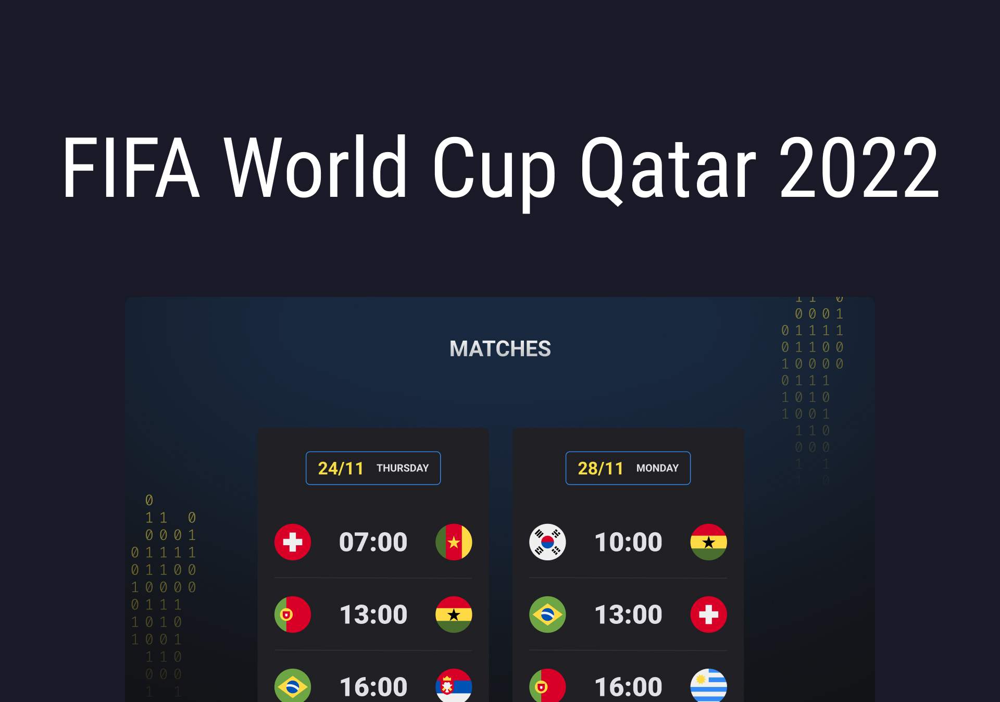

<h1 align="center"> FIFA World Cup 2022 Qatar 2022 </h1>

Project developed through the event promoted by Rocketseat for teaching WEB technologies.

  <a href="#-tecnologias">Technologies</a>&nbsp;&nbsp;&nbsp;|&nbsp;&nbsp;&nbsp;
  <a href="#-projeto">Project</a>&nbsp;&nbsp;&nbsp;|&nbsp;&nbsp;&nbsp;
  <a href="#-layout">Layout</a>&nbsp;&nbsp;&nbsp;|&nbsp;&nbsp;&nbsp;
  <a href="#memo-licença">License</a>

  

 

  

## 🚀 Technologies

This project was developed with the following technologies:

- HTML
- CSS
- JavaScript
- Git
- GitHub 

## 💻 Project

Qatar 2022 Cup Calendar, with game times in Vancouver's Time Zone (UTC/GMT -7 hours).

## 🔖 Layout

You can view the layout of the project through [LINK](https://www.figma.com/file/LcXxDLPXB4wOKpSAQNO3JZ/Calend%C3%A1rio-de-Jogos-(Community)?node-id=172%3A179). You need an account on [Figma](https://figma.com) to access it.

## :memo: License

This project is under the MIT license.

---